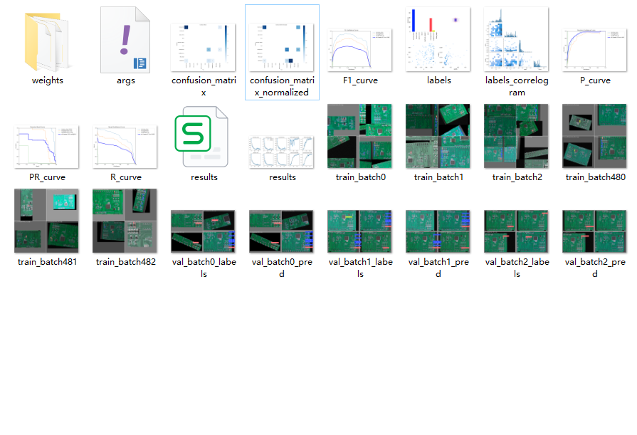
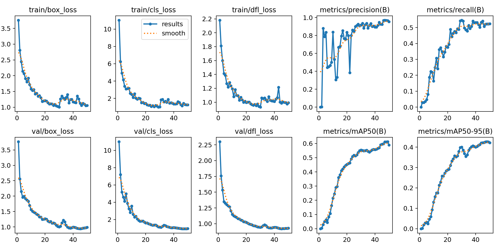
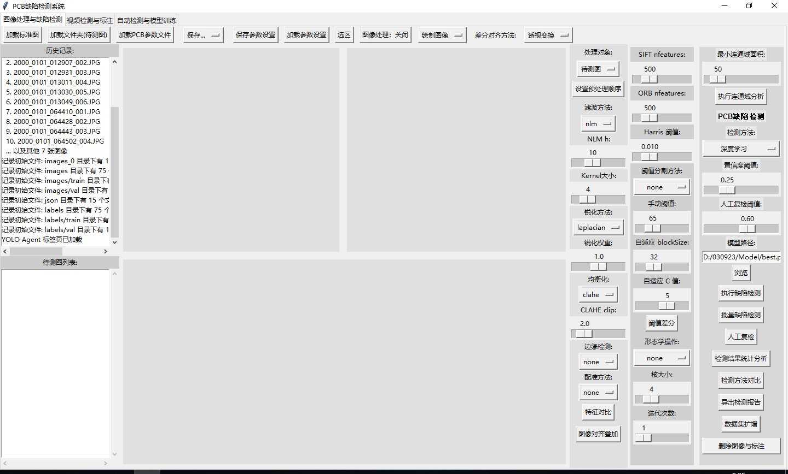
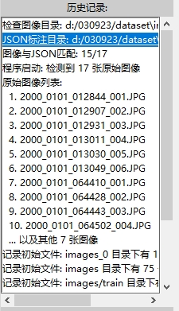
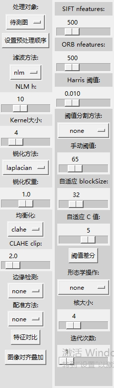
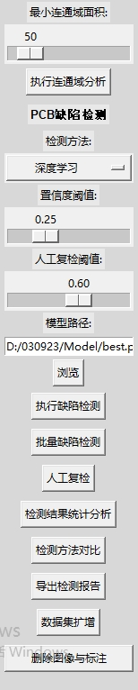

# PCB板缺陷检验系统
## 文件说明
yolo算法简介：2016 年，Joseph redom 等人首次提出 YOLO 算法，该算法作为 one-stage 算法的代表，抛弃了对于候选框的生成的计算过程，而是将整个目标检测的任务作为回归任务来处理，只需要将图像处理后直接送入卷积神经网络中进行特征提取，根据特征提取的结果便可以快速预测目标的类别、置信度分数以及 Boundingbox 的坐标。YOLO 算法将输入的图像缩放到一定尺寸，并将图像划分成n 个 cell（网格），每个网格负责检测物体中心落在该网格内的物体。YOLO 目标检测算法采用了 cell 这一网格形式为锚点框中心，抛弃了候选框的生成过程，每个 cell 同时预测两个尺度的 bounding box 以及类别信息，一步操作同时实现了位置定位和目标分类。
主文件：test.py,其中ZoomableCanvas类控制画面中的缩放与拖动。ROISelectableCanvas类主要是选区模式的逻辑，主要的逻辑在IntegratedGUI类，


## 路径说明
D:\030923\image：存放原始PCB板图像数据的备份，下面分为images_0与json子文件夹，分别用于存放图象与lableme标注文件。
D:\030923\dataset：用于存放批量进行PCB板检测时的图像数据与标注文件，以及一些用于数据增强、调整与标注转换的文件，主要是img_en.py、与图像分辨率调整.py与标注显现与检查.py等。
img_en.py用于对原始的PCB板图像数据进行增强并划分数据集，DataAugmentForObjectDetection类用于图像增强，包括旋转、裁剪、加噪声。以及函数parse_labelme_json与convert_to_yolo用于把lableme标注的json格式转换为用于yolo预测模型训练的txt格式。
数据集的划分比例是训练集70%，验证集20%，测试集10%。
主函数main中用于调整一些数据增强的参数与一些图像的路径，
```python
def main():
    # 路径设置（根据实际情况修改）
    base = "D:/030923/data/train"
    #base = "D:/030923/dataset"
    json_dir = os.path.join(base, "json")
    image_dir = os.path.join(base, "images_0")
    output_image_dir = os.path.join(base, "images")
    output_label_dir = os.path.join(base, "labels")
    os.makedirs(output_image_dir, exist_ok=True)
    os.makedirs(output_label_dir, exist_ok=True)
```
其中base就是数据集路径，下面images_0是原始的PCB板图像数据，images用于存放数据增强之后的图像数据，另外还会存放数据集划分后的训练集、验证集、测试集分别对应train、val、test路径。相应的json与labels用于存放labelme的标注文件与yolo对应增强后的数shiy文件。
dataset.yaml文件是模型训练的配置的配置文件，指定了数据集的路径与缺陷的类别，如果要修改或者增加缺陷检测的类别，则在names中添加。
```python
path: D:/030923/data/train
train: images/train
val: images/val
test: images/test
names:
  0: missing_hole   #缺焊/缺孔
  1: mouse_bite     #鼠咬
  2: open_circuit   #开路
  3: short          #短路
  4: spurious_copper #伪铜
  5: spur            #毛刺
  6: misalignment    #歪斜
  7: insufficient_tin  #多锡
  8: lifted_edge     #翘边
```

另外，图像分辨率调整.py与标注的显现与检查用于调整原始的PCB板的分辨率，用于控制数据集。标注的显现与检查用于查看json的格式转换为yolo格式是否正确。

D:\030923\data：存放单张检测工作流程用到的图像数据与训练数据集。
其中new路径用于存放新增数据的路径，即拍摄设备写入的路径，而processed用于存放检测后的数据。
单张检测工作流程的逻辑是agent.py控制，其中YOLOAgent类中控制模型训练的路径的部分如下，采取相对路径的方法：
```python
        # 项目目录结构设置
        base_dir = os.getcwd()
        ##。。。。。。
        self.new_data_dir = os.path.join(base_dir, "data", "new")          # 新的（待检测）PCB图像目录
        self.processed_dir = os.path.join(base_dir, "data", "processed")   # 已检测处理过的图像目录
        self.train_images_dir = os.path.join(base_dir, "data", "train", "images")  # 训练用图像保存目录
        self.train_labels_dir = os.path.join(base_dir, "data", "train", "labels")  # 训练用标注保存目录
        ##。。。。。。
             # 清理 runs/detect 和 runs/train 目录中过旧的结果
            if clean_runs:
                #base_dir = "D:\\030923\\agent"
                base_dir = os.path.dirname(os.path.dirname(os.path.abspath(__file__)))  # 获取agent目录
``` 
D:\030923\agent下的D:\030923\agent\yolo_output的路径下用于存放模型训练的结果，结构如下：

其中weights下存放权重文件，最好的best的权重文件与最后一次epochs的权重文件。
results显示模型训练的效果，损失函数的下降过程。


D:\030923\Model：用于存放训练好的模型，检测中用于加载的模型权重就是此路径。

D:\030923\runs：检测过程中的数据缓存，即历史数据。


## 操作说明
运行test.py文件即可，一共三个标签页，分别是图像处理与缺陷检测、视频检测与标注、自动检测与模型标注。
分别对应于已经采集的pcb板数据进行统一的检测处理、通过相机采集的视频数据来进行实时缺陷检测、一边采集一边检测的工作流。
### 图像处理与缺陷检测
其中图像处理与缺陷检测标签下初始运行输出日志信息，关于数据集路径下的图像数量与标注数量，用于检查图像与标注的txt文件的对应。


顶部按钮主要用于加载图像、保存检测结果、参数等。
中间界面上分为三个canvas，左上是显示标准图的canvas，通过加载标准图的按钮使用，右上是显示待测图的canvas显示， 通过点击加载待测图使用，再通过右边的图像预处理栏中处理对象下拉框选择处理对象，结果显示在下方的canvas上，之后的所有图像处理的操作或者检测的操作都将在结果图的canvas上进行，图像预处理中的各种参数用于传统检测方法(模式匹配)，调节好参数之后，点击阈值差分按钮即可。

检测方法通过最右侧操作栏中的检测方法下拉栏调节，默认使用深度学习方法，下方调节人工复检的阈值与加载模型路径，再下面的按钮是单张图片的缺陷检测按钮与整个文件夹的批量检测，然后是人工复检的按钮，人工复检的逻辑是当置信度低于阈值的时候自动跳出窗口询问是否进行人工复检，或者对于存疑的检测结果单独进行人工复检。

检测结果统计分析与检测结果对比用于考察检测的效果与对于各种检测方法的优劣，并且可以选择导出检测报告。
最下面的数据集扩增，通过读取初始的路径下各个文件夹下的图像，监听新增的图像，在对新增的图像进行与img_en效果一致的图像增强。
若在一边采集一边检测的工作流中收集数据，将路径改为对应的路径即可，删除图像与标注按钮用来删除对应的各个路径下的新增数据或者历史数据。

```python
    def augment_dataset(self):
        """调用img_en.py进行数据增强，只处理新增的图像"""
        try:
            # 默认数据集基础目录
            default_base_dir = os.path.join(os.path.dirname(__file__), '..', 'dataset')
            # 备选路径（注释掉）
            # default_base_dir = os.path.join(os.path.dirname(__file__), '..', 'data', 'train')
```
### 自动检测与模型标注
在自动检测与模型标注标签页中，主要实现的是一边用相机采集新增的图像一边检测并对检测结果不合格的图像进行人工复检。

检测的逻辑有两种，一种是自动检测，通过设置时间间隔并勾选自动检测来进行，均在顶部面板，另外顶部面板中还可以通过设置起始日期与终止日期来筛选数据输出统计图与进行回调。另一种方法是人工控制，通过直接点击开始检测控制，默认单击一次就检测一张图像，同样当置信度过低时询问是否进行人工复检，若检测结果通过则将检测的图像与对应的标注文件保存到对应的目录，即train/images_0与train/json,


## 依赖安装

## 


下面是一个简单的 Python 示例代码，用于打印 "Hello, world!"：


